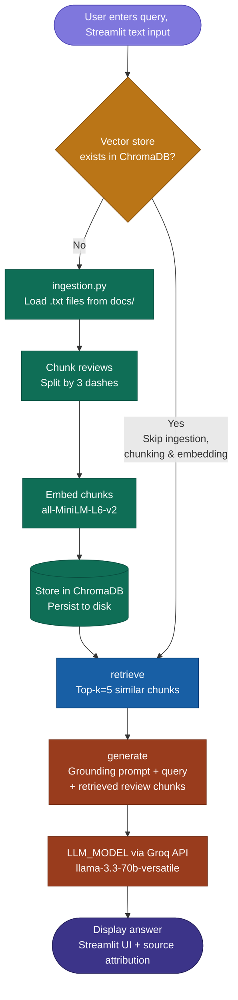

# Planning: The Unofficial Guide

---

## Domain

My domain is biomedical engineering professors at NJIT. I use the rate my professor pages to make searching for professors for certain classes and criteria easier. If a student prefers an easier professor, they can search for a more relaxed professor with an easier difficulty.

---

## Documents
Add helpful/ not helpful to rate my prfessor and difficulty/quality
<!-- List your specific sources: URLs, subreddit names, forum threads, or file descriptions.
     Aim for at least 10 sources that together cover different subtopics or perspectives within your domain. -->

| # | Source | Description | URL or File Path |
|---|--------|-------------|-----------------|
| 1 | Rate My Professors | Bryan Pfister RMP reviews | https://www.ratemyprofessors.com/professor/952505 |
| 2 | Rate My Professors | Amir Miri RMP reviews | https://www.ratemyprofessors.com/professor/2745962 |
| 3 | Rate My Professors | Mesut Sahin RMP reviews | https://www.ratemyprofessors.com/professor/799947 |
| 4 | Rate My Professors | Tara Alvarez RMP reviews | https://www.ratemyprofessors.com/professor/186910 |
| 5 | Rate My Professors | Bharat Biswal RMP reviews | https://www.ratemyprofessors.com/professor/1986630 |
| 6 | Rate My Professors | Sergei Adamovich RMP reviews | https://www.ratemyprofessors.com/professor/404160 |
| 7 | Rate My Professors | Eun Jung Lee RMP reviews | https://www.ratemyprofessors.com/professor/1696813 |
| 8 | Rate My Professors | Jongsang Son RMP reviews | https://www.ratemyprofessors.com/professor/2833328 |
| 9 | Rate My Professors | Vivek Kumar RMP reviews | https://www.ratemyprofessors.com/professor/2341169 |
| 10 | Rate My Professors | Treena Arinzeh RMP reviews | https://www.ratemyprofessors.com/professor/212358 |
| 11 | Rate My Professors | Joel Schesser RMP reviews | https://www.ratemyprofessors.com/professor/1933579 |
| 12 | Reddit r/NJTech | General Biomedical Engineering discussion | https://www.reddit.com/r/NJTech/comments/zuq7xj/biomedical_engg/ |
| 13 | Reddit r/NJTech | BME_303 discussion | https://www.reddit.com/r/NJTech/comments/1ibifdu/bme_303/ |
| 14 | Reddit r/NJTech | BME_301 discussion | https://www.reddit.com/r/NJTech/comments/aetaao/bme301/ |
| 15 | Reddit r/NJTech | Tips for BME_303 with Haorah | https://www.reddit.com/r/NJTech/comments/l1be46/tips_for_bme_303_w_haorah/ |
| 16 | Reddit r/NJTech | Is there any hope BME_301 discussion | https://www.reddit.com/r/NJTech/comments/bghlgu/is_there_any_hope_bme_301/ |
| 17 | Reddit r/NJTech | Which BME track should I choose discussion | https://www.reddit.com/r/NJTech/comments/13e9tx8/which_bme_track_should_i_choose_and_why/ |
| 18 | Reddit r/NJTech | BME_302 discussion | https://www.reddit.com/r/NJTech/comments/1ojsc6o/bme_302/ |

---

## Chunking Strategy

**Chunk size:** For RMP (Rate My Professor) each REVIEW block in the .txt files is treated as a single chunk regardless of length.

**Overlap:** None overlap is unnecessary because reviews do not share context across boundaries. Each review is written independently by a different student.

**Reasoning:** This is the best fit for the data because each review is already a self-contained opinion. A query like "Is Dr. Sahin a tough grader?" should match one specific review, not half of two different reviews merged together.

**Expected chunk count:** Approximately 120–150 chunks across 11 professor files, which is within the healthy range for this corpus size.

---

## Retrieval Approach

<!-- Which embedding model are you using (e.g., all-MiniLM-L6-v2 via sentence-transformers)?
     How many chunks will you retrieve per query (top-k)?
     If you were deploying this for real users and cost wasn't a constraint, what tradeoffs
     would you weigh in choosing a different embedding model — context length, multilingual
     support, accuracy on domain-specific text, latency? -->

**Embedding model:** For this task it's ok to use the all-MiniLM-L6-v2 once again since its general purpose fast and light-weight which is good for short reviews. API models are generally mroe accuarate but incure latency from added network RTT. 

**Top-k:** 5
For reviews context and number of reviews is important. Making a suggesiton off of very little reviews isnt very helpful as perspectives vary and giving a user a good consesus is important. I'd get the top 5 reviews. This is to give the model enough context to work with and paint a better picture of how professors teaches across courses. Since reviews are short this won;t bloat the context window 

**Production tradeoff reflection:** If cost wasn't a contraint then I would use larger more accurate models that embed in higher dimensions. I would also use a model thats built specifically for question answer pairing, which models the relationship reviews answer. In this case a multi-lingual model is not needed since all reviews are in english and text is in casual english so a genral model is fine. 

---

## Evaluation Plan

<!-- 5 test questions with their expected correct answers.
     Questions should be specific enough that you can judge whether the system's response
     is right or wrong. "What are good dining halls?" is too vague. -->

| # | Question | Expected Answer |
|---|----------|-----------------|
| 1 | Is Bryan Pfister a laid back professor? | Yes, based on reviews Pfister is considered an easy and fair professor if you attend class and take notes. His exams come directly from his notes and he gives projects and homework to boost grades. |
| 2 | I'm looking for a BME 301 professor that teaches well and difficulty isn't an obstacle | Based on reviews, Mesut Sahin is knowledgeable and makes instrumentation engaging, though recent reviews warn his exams can be unpredictable and grades inconsistent. Schesser is knowledgeable but old school and intimidating to ask questions. |
| 3 | What do students say about Amir Miri's BME 680 course? | Reviews are sharply divided — positive reviews praise the project-based learning and real world scenarios, while negative reviews say he favors PhD students, shames struggling students, and dramatically changes the syllabus after the drop date. |
| 4 | Which NJIT BME professor is most recommended for caring about students? | Jongsang Son is consistently praised as genuinely caring about student success, going in depth on problems, and making sure everyone understands lectures. Multiple reviewers call him the best professor they've had at NJIT. |
| 5 | What do students say about the difficulty of Eun Jung Lee's exams? | Students consistently report her exams and assignments are disconnected from what she teaches in class, with class averages in the 50s. Multiple reviewers say she grades randomly and does not answer questions clearly. |

---

## Anticipated Challenges

<!-- What could go wrong? 
     Considering: noisy or inconsistent documents, missing source attribution, off-topic
     retrieval, chunks that split key information across boundaries. -->

1. One real risk of reviews is how is the inconsistency in opinionated data. This inconsistency could be challenging to give a satisying aswer to. That is giving a lot of context is important

2.  Another is directly misleading content in reviews. Again this is solved by having a majority of reviews that accurately help answer the query

---

## Architecture

<!-- Draw a diagram of your pipeline showing the five stages:
     Document Ingestion → Chunking → Embedding + Vector Store → Retrieval → Generation
     Label each stage with the tool or library you're using.
     You can use ASCII art, a Mermaid diagram, or embed a sketch as an image.
     You'll use this diagram as context when prompting AI tools to implement each stage. -->

## Architecture

---

## AI Tool Plan

**Milestone 3 — Ingestion and chunking:**
I will use Claude to help implement the ingestion pipeline. I will provide the chunking strategy from the planning document and examples of Rate my Professor reviews. It will also generate Python functions to read the RMP(Rate my professor) files, split them into chunks using 3 dash separators between sections, and have metadata such as professor name chunk number. The data would include the professor, review, course, quality rating, difficulty rating, would take again, tags, and source URL. I will verify the output by inspecting the generated chunks an making sure that reviews are chunked and seperated properly 1 by 1. 

**Milestone 4 — Embedding and retrieval:**
I will use Claude to generate the embedding and retrieval code. I will provide my Retrieval Approach section from this document and the chunk format from Milestone 3 as input. I will ask Claude to implement a script that loads chunks from the ingestion pipeline, embeds them using all-MiniLM-L6-v2 via sentence-transformers, stores them in ChromaDB with metadata fields for professor name, course, and source URL, and implements a retrieve() function that accepts a query string and returns the top 5 most similar chunks with their distance scores. I will verify by running 3 of my 5 evaluation questions against the vector store and manually
checking that returned chunks are visibly relevant to each query and that distance scores are below 0.6.

**Milestone 5 — Generation and interface:**
I will use Claude to generate the generation and Streamlit interface code. I will provide my grounding requirement (answers from retrieved context only, no outside knowledge), the generate_response() structure from my previous project as a reference, and the output format I want (answer + source professor and URL). I will ask Claude to adapt the Groq client pattern I already have using llama-3.3-70b-versatile, update the system prompt to reference BME professor reviews instead of , and build a Streamlit interface with a text input for the query, a response box for the answer, and a sources section showing which professor files were retrieved. I will verify grounding by asking a question my documents don't cover and confirming the system says it doesn't have enough information rather than generating a possible answer from general knowledge.